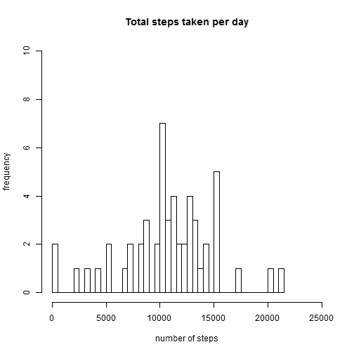
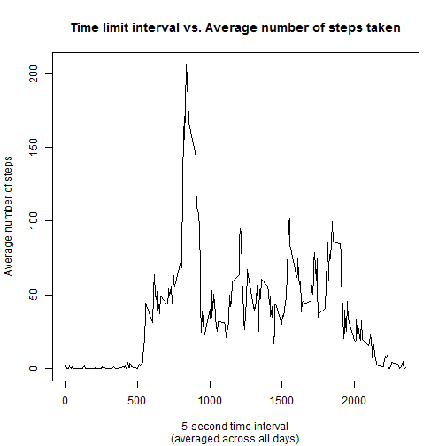
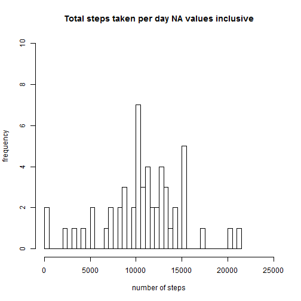
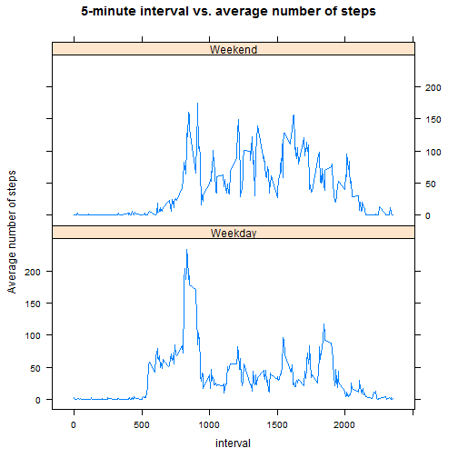

## Reproducible research assignment 1


### Part 1: Loading and preprocessing the data   

```r
activity <- read.csv(file="./activity/activity.csv", header=T, as.is=T, na.strings = "NA")
activity$date <- as.Date(activity$date)
```


### part 2: What is mean total number of steps taken per day?   
#### Make a histogram of the total number of steps taken each day      

```r
data1 <- tapply(activity$steps, activity$date, sum)
hist(data1, 
     main="Total steps taken per day", 
     ylab="frequency", 
     xlab="number of steps", 
     breaks=length(data1), 
     xlim=range(0, 25000), 
     ylim=range(0,10)
)
```



#### Calculate and report the mean and median total number of steps taken per day   
The mean number of steps per day is **37.3826** with the Median mesure is at **0**


### Part 3: What is the average daily activity pattern?   

#### Make a time series plot (i.e. type = "l") of the 5-minute interval (x-axis) and the average number of steps taken, averaged across all days (y-axis)   

```r
df <- aggregate.data.frame(activity$steps, 
                           by=list(activity$interval), FUN=mean, na.rm=T)

names(df) <- c("interval", "average")
plot(df$interval, df$average, 
     type="l", 
     main = "Time limit interval vs. Average number of steps taken",
     ylab = "Average number of steps", 
     xlab = "5-second time interval",
     sub = "(averaged across all days)"
     )
```




#### Which 5-minute interval, on average across all the days in the dataset, contains the maximum number of steps?   

```r
df[which.max(df$average), "interval"]
```

```
## [1] 835
```


### Part 4: Imputing missing values   

#### Calculate and report the total number of missing values in the dataset (i.e. the total number of rows with NAs)   
The dataset has a total of **2304** missing values   

#### Devise a strategy for filling in all of the missing values in the dataset. The strategy does not need to be sophisticated. For example, you could use the mean/median for that day, or the mean for that 5-minute interval, etc.   

The original dataset looks like 

```
##    steps       date interval
## 1     NA 2012-10-01        0
## 2     NA 2012-10-01        5
## 3     NA 2012-10-01       10
## 4     NA 2012-10-01       15
## 5     NA 2012-10-01       20
## 6     NA 2012-10-01       25
## 7     NA 2012-10-01       30
## 8     NA 2012-10-01       35
## 9     NA 2012-10-01       40
## 10    NA 2012-10-01       45
```

With the transformations below, I replaced ***NA*** values with the mean steps for that time interval across all days.


```r
activity2 <- activity
agg.means <- aggregate(activity2$steps, 
                       by=list(activity2$interval), FUN=mean, na.rm=T)

names(agg.means) <- c("interval", "interval.means")
agg.means$interval.means <- signif(agg.means$interval.means, digits=2)

for(i in 1:nrow(activity2)){     
        if(is.na(activity2$steps[i]))  
                activity2$steps[i] <- agg.means[i,2]
}
```

The new dataset looks like this   

```
##    steps       date interval
## 1  1.700 2012-10-01        0
## 2  0.340 2012-10-01        5
## 3  0.130 2012-10-01       10
## 4  0.150 2012-10-01       15
## 5  0.075 2012-10-01       20
## 6  2.100 2012-10-01       25
## 7  0.530 2012-10-01       30
## 8  0.870 2012-10-01       35
## 9  0.000 2012-10-01       40
## 10 1.500 2012-10-01       45
```


#### Make a histogram of the total number of steps taken each day and Calculate and report the mean and median total number of steps taken per day. Do these values differ from the estimates from the first part of the assignment? What is the impact of imputing missing data on the estimates of the total daily number of steps?   


```r
data2 <- with(activity, tapply(steps, date, sum))
hist(data2, 
     main="Total steps taken per day NA values inclusive", 
     ylab="frequency", 
     xlab="number of steps", 
     breaks=length(data2), 
     xlim=range(0, 25000), ylim=range(0,10)
     )
```



With the ***NA*** values corrected, The mean number of steps per day is **37.3828** and the Median mesure is at **0**  
From comparisons with the original activity dataset (containing NA values), missing data has no effect on the median. The change on the mean is ignorable (2.38 &times; 10<sup>-4</sup> )


      


### Part 5: Are there differences in activity patterns between weekdays and weekends?  
#### Create a new factor variable in the dataset with two levels - "weekday" and "weekend" indicating whether a given date is a weekday or weekend day.


```r
activity2$dayGroup <- weekdays(activity2$date)

index1 <- grep("^(mon|tue|wed|thur|fri)", activity2$dayGroup, ignore.case = T)
index2 <- grep("^(sat|sund)", activity2$dayGroup, ignore.case = T)

activity2[index1, 4] <- "Weekday"
activity2[index2, 4] <- "Weekend"

activity2$dayGroup <- factor(activity2$dayGroup)
```


#### Make a panel plot containing a time series plot (i.e. type = "l") of the 5-minute interval (x-axis) and the average number of steps taken, averaged across all weekday days or weekend days (y-axis).   

```r
agg.means2 <- aggregate(activity2$steps, 
               by=list(activity2$interval, activity2$dayGroup),
               FUN=mean, na.rm=T)
names(agg.means2) <- c("interval", "dayGroup", "means")


xyplot(agg.means2$means ~ agg.means2$interval | agg.means2$dayGroup, 
       layout=c(1,2),
       type="l",
       xlab = "interval",
       ylab = "Average number of steps",
       main = "5-minute interval vs. average number of steps")
```


